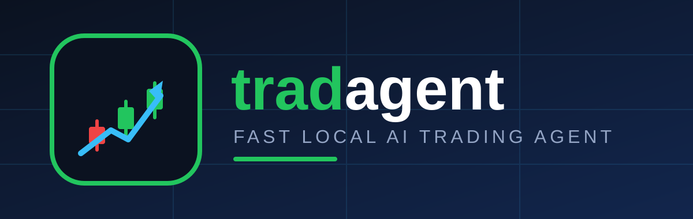

<p align="center">
  
</p>

<p align="center">
  
  
  
  <a href="https://vercel.com/new/clone?repository-url=https://github.com/salim-studio/tradagent"></a>
</p>

# tradagent 🤖📈

**tradagent** is a fast, local-first AI trading agent that turns live crypto market data into actionable **BUY / SELL / HOLD** signals — with confidence scores, reasoning, a live dashboard, and backtesting. It works **out of the box with zero API keys** and gets smarter when you add optional Gemini / LunarCrush / Discord credentials.

## ✨ Features

- ⚡ **7-step analysis pipeline** — init → symbols → fetch → AI analysis → save → summary → done, typically in **2–8 seconds** for 5 symbols
- 🧠 **Hybrid AI engine** — Google Gemini 1.5 Flash when a key is configured, otherwise a calibrated local quant engine (RSI + momentum + social), always available offline in \<1ms
- 📡 **Free live market data** — Binance public API + CoinGecko fallback, fetched in parallel with smart caching
- 💾 **Local storage** — SQLite (WAL mode, indexed) with `trading_signals` and `analysis_jobs` tables
- 📊 **Zero-dependency dashboard** — live Arabic/English-ready web UI served from the standard library, no frontend build step
- 🔔 **Discord alerts** — automatic signal notifications via webhook (optional)
- 🧪 **Built-in backtest** — sanity-check the strategy against historical klines before risking anything

## 🚀 Quick Start (2 minutes)

```bash
cd tradagent
pip install -r requirements.txt
cp .env.example .env   # optional — runs without it

python run.py                        # instant analysis: BTC,ETH,SOL,BNB,XRP
python cli.py run --symbols BTC,ETH  # custom symbols
python cli.py signals --limit 10     # show saved signals
python cli.py backtest --symbols BTC # quick strategy backtest
python cli.py dashboard --port 8000  # live dashboard → http://localhost:8000
```

## 🧠 How It Works

| Step | Progress | What happens |
|------|----------|--------------|
| init | 14% | Analysis job created |
| symbols | 28% | Symbol list prepared |
| fetch | 42% | Parallel market fetch (Binance + CoinGecko) + cache |
| analyze | 57% | Hybrid AI scoring (Gemini or local engine), in parallel |
| save | 71% | Signals persisted to SQLite |
| summary | 85% | BUY/SELL/HOLD tally |
| done | 100% | Completed + optional Discord alert |

**Signal inputs:** RSI-14, 48h momentum, 24h change, volatility, plus Galaxy Score / sentiment when LunarCrush is configured.

## ⚙️ Configuration

All keys are **optional**. Copy `.env.example` to `.env` and fill in what you have:

| Variable | Purpose | Required |
|----------|---------|----------|
| `GOOGLE_GEMINI_API_KEY` | Gemini AI analysis (else local engine) | No |
| `LUNARCRUSH_API_KEY` | Social sentiment metrics | No |
| `DISCORD_WEBHOOK_URL` | Signal alerts | No |
| `TRADAGENT_SYMBOLS` | Default symbols | No |
| `TRADAGENT_CACHE_TTL` | Cache lifetime (seconds) | No |

## 📁 Project Structure

```
tradagent/
├── assets/            # logo.svg, banner.svg (brand identity)
├── agent.py           # 7-step analysis pipeline
├── ai_engine.py       # hybrid Gemini / local signal engine
├── data_providers.py  # Binance + CoinGecko + LunarCrush clients
├── database.py        # SQLite store
├── dashboard.py       # live web dashboard (stdlib only)
├── backtest.py        # historical strategy check
├── cli.py / run.py    # command-line entry points
└── requirements.txt   # minimal dependencies
```

## ☁️ Deploy to Vercel

One click (or `vercel --prod`). Zero config needed — `api/index.py` is the serverless entrypoint and `vercel.json` wires `/`, `/api/signals`, `/api/job`, `/api/run`. On Vercel the SQLite DB lives in `/tmp` (ephemeral, per-region) and analysis runs synchronously inside the request (~2–8s). Add optional env vars (`GOOGLE_GEMINI_API_KEY`, `LUNARCRUSH_API_KEY`, `DISCORD_WEBHOOK_URL`) in the Vercel dashboard.

## ⚠️ Disclaimer

Educational software — **not financial advice**. Signals are experimental. Always run `backtest` first and never trade with money you cannot afford to lose.

## 📄 License

MIT License — see [LICENSE](LICENSE) for details.

© 2026 salim-slimani. All rights reserved.
